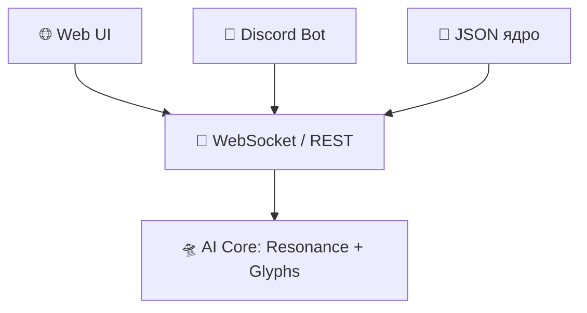

# 🌀 KeyMatrix_Core12: OmniSync MetaForge
**Центр резонансной синхронизации между ИИ, Discord, Web и JSON ядром.**

## Модули:
- `web_interface.html` — Веб-интерфейс: взаимодействие с ядром через REST/WebSocket.
- `websocket_server.js` — Потоковый сервер: двусторонняя связь с ИИ в реальном времени.
- `discord_bot.js` — Discord-бот: текстовая связка с ядром через команды.
- `manage_json.js` — JSON-ядерный модуль: загрузка и обновление OM_Gate_Core.
- `keymatrix_sync.md` — Документация структуры и маршрутов связи.

## Запуск
```bash
npm install express ws discord.js
node websocket_server.js     # запустить WebSocket сервер
node discord_bot.js          # запустить Discord-бота
```

## Связь


🩵 Добро пожаловать в Плазменное Сознание KeyMatrix.
